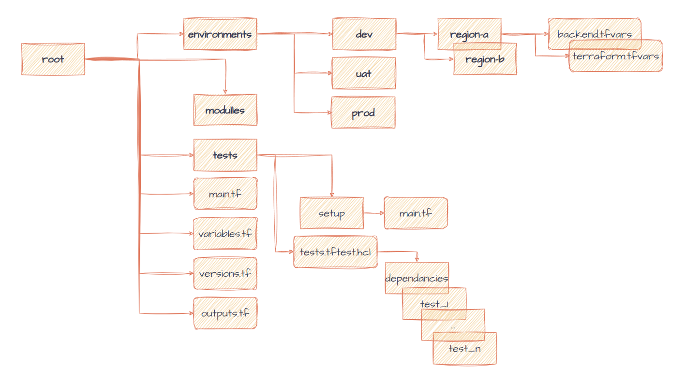

# terraform-projects-structure
Materials for terraform best project structure presentation

Simple code example:
```bash
ENV=dev
REGION=eu-central-1
terraform init -backend-config="./enviroments/${ENV}/${REGION}/backend.tfvars"
terraform plan -var-file="./enviroments/${ENV}/${REGION}/backend.tfvars" -out "terraform.tfplan" 
terraform show --json "terraform.tfplan" | convert_report > tfplan.json 
```


## Init example, will be updated!


